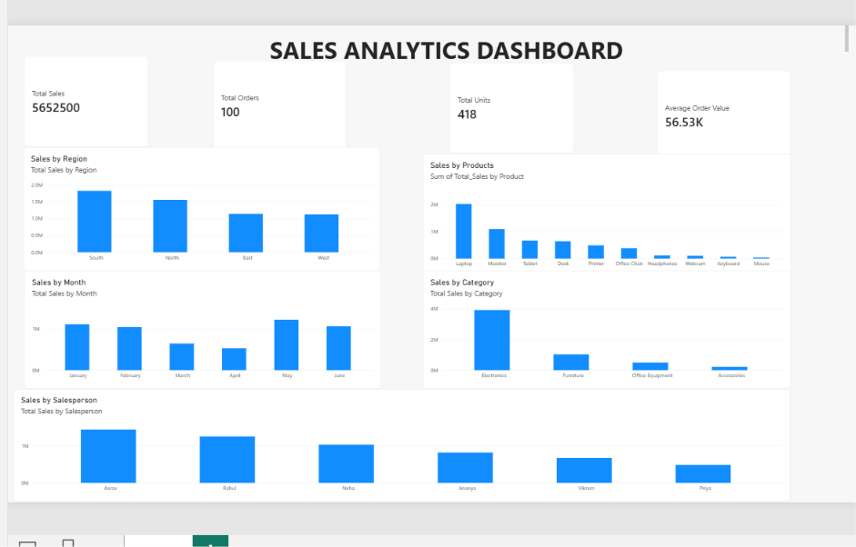

# Sales Analytics Dashboard

A beginner-friendly **Sales Analytics project** built using **Excel, SQL, and Power BI** to analyze sales performance and generate data-driven business insights.

##Project Objective

The objective of this project is to analyze sales data and understand:

- Overall sales performance
- Regional sales performance
- Product-wise sales
- Monthly sales trends
- Category performance
- Salesperson performance
- Average order value

## 🛠️ Tools & Technologies

- **Microsoft Excel** – Data cleaning, calculations and dashboard
- **MySQL** – Data analysis using SQL queries
- **Power BI** – Interactive dashboard and data visualization

##  Key Performance Indicators

| KPI | Value |
|---|---:|
| Total Orders | 100 |
| Total Units Sold | 418 |
| Total Sales | ₹5,652,500 |
| Average Order Value | ₹56,525 |

##  Dashboard

##  Key Insights

- **South region** generated the highest sales among the four regions.
- **North region** was the second-highest sales region.
- **Electronics** was the highest-performing category.
- Sales performance varied across the six months analyzed.
- Sales performance differed across individual salespersons.
- **Laptop** was the highest-priced product in the dataset.

##  Project Files

| File | Description |
| `Sales_Analytics_Project_Dataset.xlsx` | Excel workbook containing the dataset and analysis |
| `Sales_Analytics_Dataset.csv` | CSV version of the sales dataset |
| `Sales_Queries.sql` | SQL queries used for sales analysis |
| `Sales_Analytics_Dashboard.pbix` | Power BI dashboard |
| `dashboard.png` | Screenshot of the Power BI dashboard |

##  Skills Demonstrated

- Data Cleaning
- Excel Data Analysis
- SQL Queries
- Aggregation & Filtering
- KPI Analysis
- Data Visualization
- Power BI Dashboard Development
- Business Insights

##  About the Project

This project was created as part of my journey toward becoming a **Data Analyst** and demonstrates practical experience with Excel, SQL, and Power BI.

**Created by Khushi Saini**
